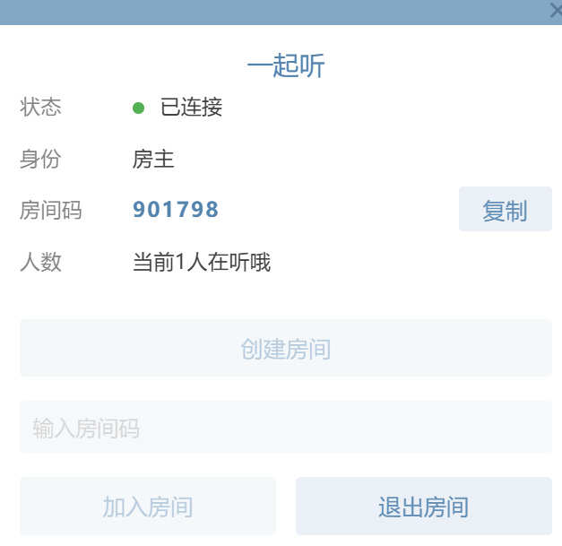

# Cile Music 桌面版 · 一起听

<p align="center"></p>

基于 [LX Music 桌面版](https://github.com/lyswhut/lx-music-desktop)（v2.12.2）魔改的个人版本（Electron 40 + Vue 3 + TypeScript），核心改动是加入了**「一起听」功能**：与另一台设备（电脑与电脑、电脑与手机）加入同一房间后，房主的播放状态会实时同步到所有听客端。

> 原始项目 By 落雪无痕（LX Music），Cile Music 修改版 By Ci Le。遵循上游开源协议（Apache-2.0）。

## 一起听是什么
零基础小白完全用AI来完成魔改的用来和对象一起听歌嘿嘿

- **房主广播、听客跟随**：房主的切歌、播放、暂停都会同步给房间内所有人，进度条每 2 秒心跳对齐
- **跨端互通**：桌面端 ↔ 桌面端、桌面端 ↔ 安卓端（[移动版仓库](https://github.com/Tiannn0512/lx-music-mobile-together)）都可以一起听
- **进度对齐**：切歌后听客自动对齐房主当前进度（含加载耗时补偿的追踪式对齐）；中途加入房间先同步房主的完整播放状态
- **顶部入口**：顶栏双人图标打开一起听面板，创建/加入/退出一目了然

## 使用方法

1. 两台设备都打开 Cile Music
2. 电脑端点击顶栏（或侧边栏，取决于控制按钮位置设置）的 **双人图标**
3. 一端 **「创建房间」**，把 6 位房间码告诉对方
4. 对方输入房间码 **「加入房间」**，房主播放即可 🎵

## 自建服务器

客户端默认连接官方演示服务器（Render 免费实例，冷启动约 20 秒）。你也可以自己搭：

- 本地运行：`npm install && npm start`（默认端口 3000，支持 `PORT` 环境变量）
- 客户端改服务器地址：[`src/renderer/core/together/index.ts`](src/renderer/core/together/index.ts) 的 `SERVER_URL` 常量，改成你的 `wss://你的域名`，重新打包即可

## 开发与打包

```bash
npm install       # 安装依赖
npm run dev       # 开发调试
npm run pack      # 构建 Windows x64 安装程序（输出在 build/ 目录）
npm run pack:win  # 构建全部 Windows 安装程序（x86/x64/arm64）
```

- 当前版本：v3.0.0

## 目录导览（一起听相关）

- `src/renderer/core/together/` — 一起听核心逻辑（WebSocket 连接、房间管理、消息协议、同步控制器）
- `src/renderer/components/Together/` — 一起听面板 UI（按钮、面板、文字切换动画）
- `src/renderer/views/Setting/components/SettingAbout.vue` — 关于页（版本与署名）

## 许可

本项目基于 LX Music 桌面版修改，遵循 [Apache-2.0](https://github.com/lyswhut/lx-music-desktop/blob/master/LICENSE) 协议开源。
